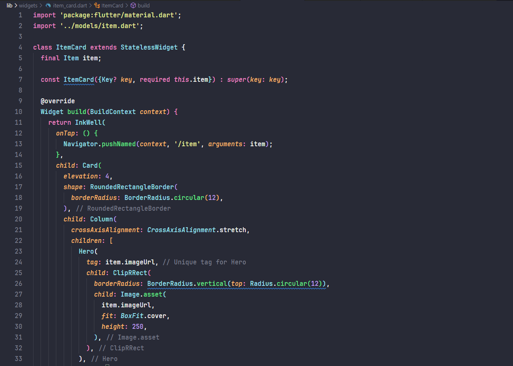

# PRAKTIKUM 5 : MEMBANGUN NAVIGASI DI FLUTTER
## Langkah 1: Siapkan project baru
Jawaban:
 

 
## Langkah 2: Mendefinisikan Route
Jawaban:
 

 

 
## Langkah 3: Lengkapi Kode di main.dart
Jawaban:
 

 
## Langkah 4: Membuat data model
Jawaban:
 

 
## Langkah 5: Lengkapi kode di class HomePage
Jawaban:
 

 
## Langkah 6: Membuat ListView dan itemBuilder
Jawaban:
 

 
## Langkah 7: Menambahkan aksi pada ListView
Jawaban:
 

   

## OUTPUT PROGRAM

 

   

# TUGAS PRAKTIKUM 2
## 1. Untuk melakukan pengiriman data ke halaman berikutnya, cukup menambahkan informasi arguments pada penggunaan Navigator. Perbarui kode pada bagian Navigator menjadi seperti berikut.
Jawaban:
 

 

## 2. Pembacaan nilai yang dikirimkan pada halaman sebelumnya dapat dilakukan menggunakan ModalRoute. Tambahkan kode berikut pada blok fungsi build dalam halaman ItemPage. Setelah nilai didapatkan, anda dapat menggunakannya seperti penggunaan variabel pada umumnya. (https://docs.flutter.dev/cookbook/navigation/navigate-with-arguments)
Jawaban:
 

 

## 3. Pada hasil akhir dari aplikasi belanja yang telah anda selesaikan, tambahkan atribut foto produk, stok, dan rating. Ubahlah tampilan menjadi GridView seperti di aplikasi marketplace pada umumnya.
Jawaban:
 
#### Modifikasi home_page: 

 

 
#### Modifikasi item_page: 

 
#### Modifikasi Model Item: 

 
#### OUTPUT: 

 

 

## 4. Silakan implementasikan Hero widget pada aplikasi belanja Anda dengan mempelajari dari sumber ini: https://docs.flutter.dev/cookbook/navigation/hero-animations
Jawaban:
 
#### Modifikasi dengan Penambahan File item_card di folder widget: 

 

 
#### OUTPUT: 

 

 

## 5. Sesuaikan dan modifikasi tampilan sehingga menjadi aplikasi yang menarik. Selain itu, pecah widget menjadi kode yang lebih kecil. Tambahkan Nama dan NIM di footer aplikasi belanja Anda.
Jawaban:
 
#### Modifikasi dengan Penambahan File footer di folder widget: 

 
#### Modifikasi dengan Pemanggilan Footer 

 
 
#### OUTPUTr 

 

## 6. Selesaikan Praktikum 5: Navigasi dan Rute tersebut. Cobalah modifikasi menggunakan plugin go_router, lalu dokumentasikan dan push ke repository Anda berupa screenshot setiap hasil pekerjaan beserta penjelasannya di file README.md. Kumpulkan link commit repository GitHub Anda kepada dosen yang telah disepakati!